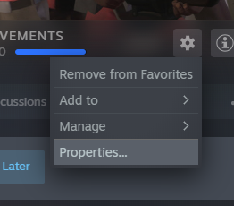
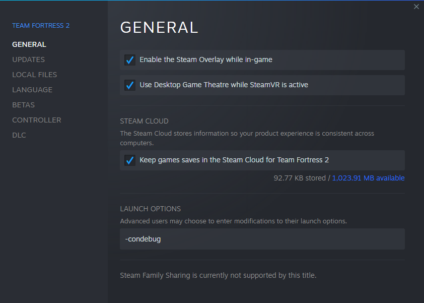

 # TF2 Stats

## Installation

**1. Library** 
  

  
**2. Properties** 
   add `-condebug` to the launch parameters  
  

## Development

**3. Requirements**
 > nimble install regex
 > nimble install norm
 > nimble install nigui
 > nimble install ws

**4. Compile & Execute**
 > nim c -d:release -r src/main

## Dependencies
> - [nimble regex](https://github.com/nitely/nim-regex)
> - nimble norm
> - nimble nigui
> - [nimble ws](https://github.com/treeform/ws)
> - [Tachyons css](https://github.com/tachyons-css/tachyons/)
> - [Glider js](https://github.com/NickPiscitelli/Glider.js)
